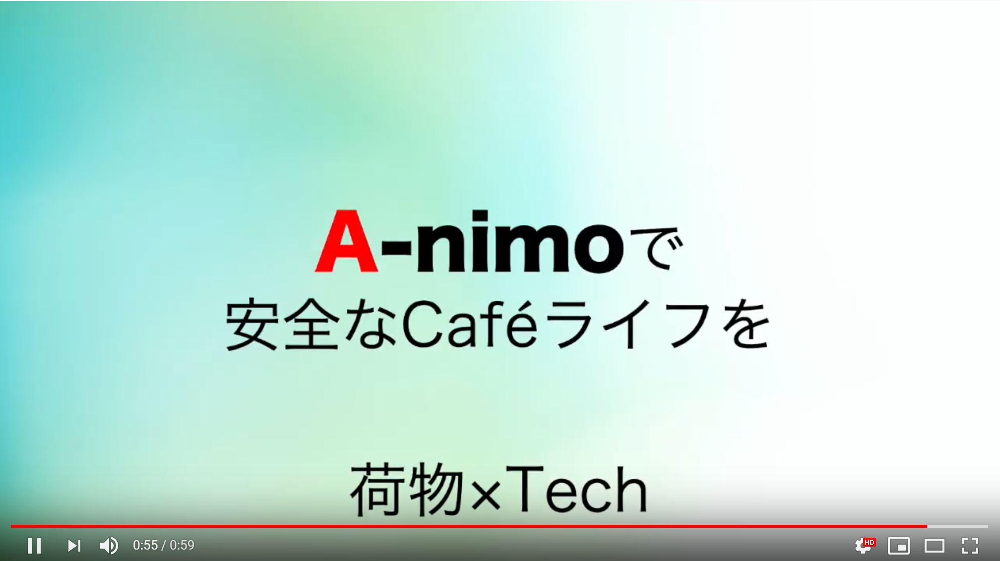

# サンプル（プロダクト名）
みまもるん(仮)

## 製品概要
### 荷物 × Tech

### 背景（製品開発のきっかけ、課題等）
カフェなどで荷物を置いて席を立つのが不安

### 製品説明（具体的な製品の説明）
こちらに製品の概要・特徴について説明を記載してください。

### 特長

#### 1. 特長1
加速度センサとスマホを使って荷物が触られてないかリアルタイムで把握できる
#### 2. 特長2

#### 3. 特長3

### 解決出来ること
安心してカフェで席をたてる。

### 今後の展望
今回は実現できなかったが、今後改善すること、どのように展開していくことが可能かについて記載をしてください。

## 開発内容・開発技術
### 活用した技術
#### フレームワーク・ライブラリ・モジュール
* サーバ
  * Amazon EC2
  * Amazon DynamoDB 
  * Node.js
* iPhone
  * Swift
* Raspberry Pi Zero
  * Python

#### デバイス
* iPhone
* Raspberry Pi Zero
* 加速度センサ

### 独自開発技術（Hack Dayで開発したもの）
#### 2日間に開発した独自の機能・技術
* 独自で開発したものの内容をこちらに記載してください
* 特に力を入れた部分をファイルリンク、またはcommit_idを記載してください（任意）
